# FoamOps

A Nerf game operations prop built on the ESP32 Cheap Yellow Display (CYD). Plug it in, pick a game mode, and play. No phone, no laptop, no setup on the field.

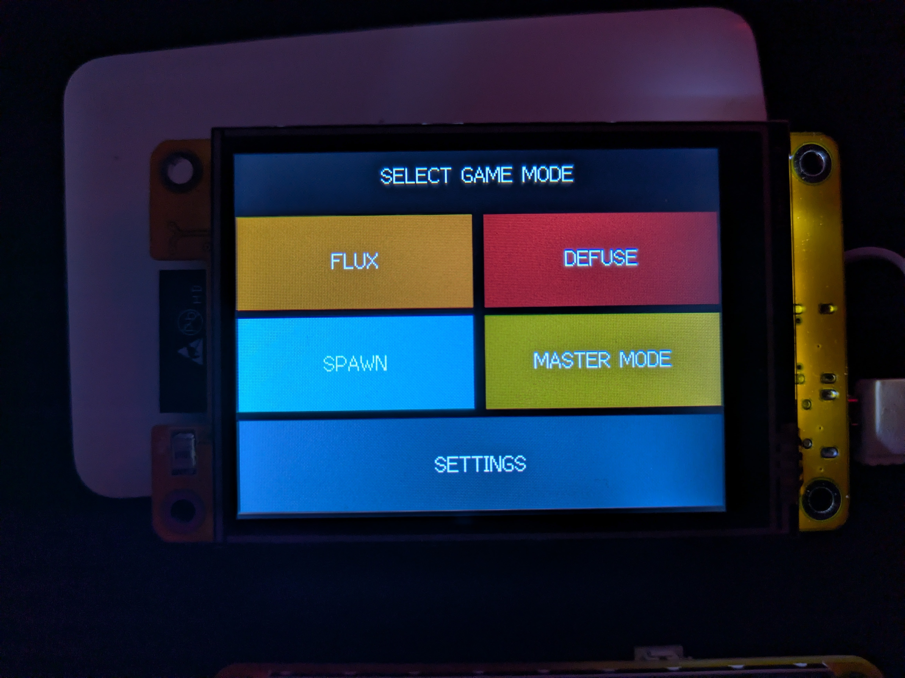

## Flash It

The easiest way to get FoamOps onto your CYD is via the web flasher — no Arduino IDE needed.

**[Open Web Flasher →](https://kghunt.github.io/FoamOps/)**

1. Connect your CYD to your PC via USB
2. Open the link above in Chrome or Edge (other browsers not supported)
3. Click **Install FoamOps**
4. Select your COM port when prompted
5. **Hold the BOOT button** on the back of the board until the progress bar starts moving — the screen may flash on and off until you do
6. Release BOOT and wait ~30 seconds for flashing to complete
7. The device reboots automatically into the game mode selector

> First-time flash will erase existing firmware. Settings (brightness, sound, display invert) are saved to the device after first configuration.

---

## Required Hardware

- **ESP32-2432S028R** — the Cheap Yellow Display (CYD), 2.8" ILI9341 touchscreen — [buy on Amazon UK](https://www.amazon.co.uk/dp/B0CQX9Q68P?ref=ppx_yo2ov_dt_b_fed_asin_title)
- **USB-C cable** for flashing
- **3W 4Ω JST speaker** (optional) — for sound effects. Connects to the JST port on the board
- **Power** — 18650 battery or USB power bank recommended for field use

---

## Game Modes

### Flux — Two-Team Domination Timer

Two teams, two timers. Tap your team's side of the screen to start your timer running — the other team's timer freezes. First team to run down the game clock wins.

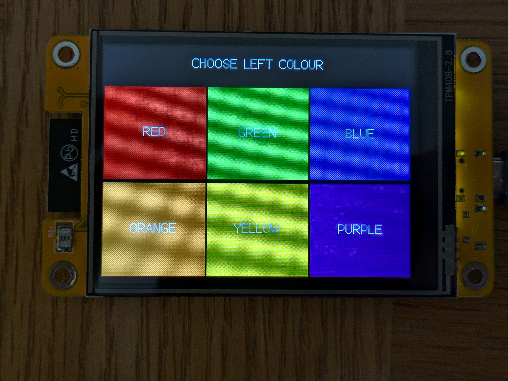
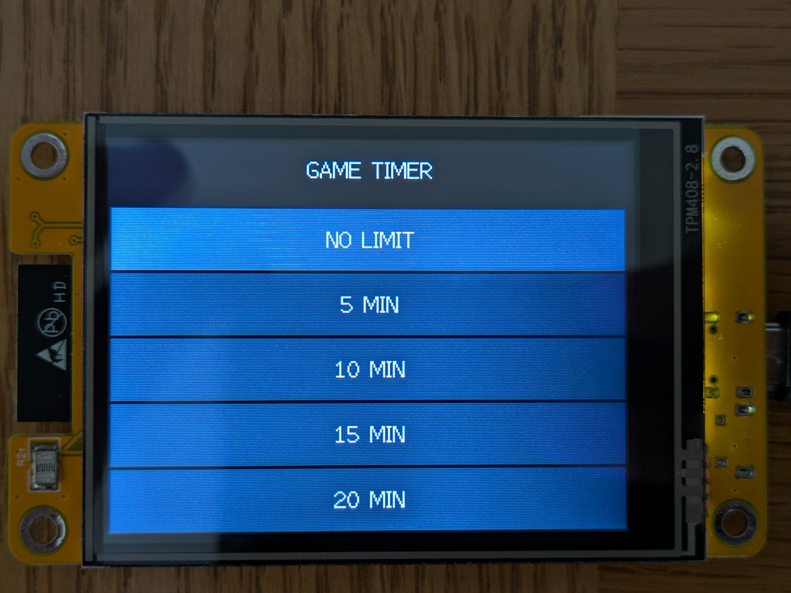
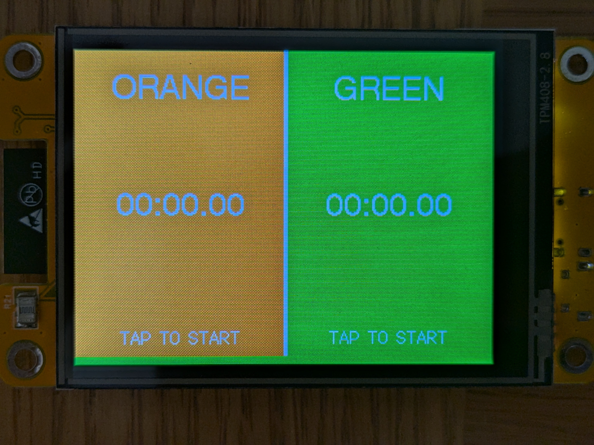

**Controls:**
- Tap left or right half → that team's timer runs, other pauses
- Hold 1.5 s → pause game
- Hold top-left corner → return to mode select (use this to reset)

**Setup options:**
- Choose team colours for each side (Red, Green, Blue, Orange, Yellow, Purple)
- Set a game time limit (No Limit, 5, 10, 15, or 20 minutes)

---

### Defuse — Bomb Countdown

A bomb is set with a countdown timer. Players must defuse it before it reaches zero or it explodes. Two defuse puzzle types available.

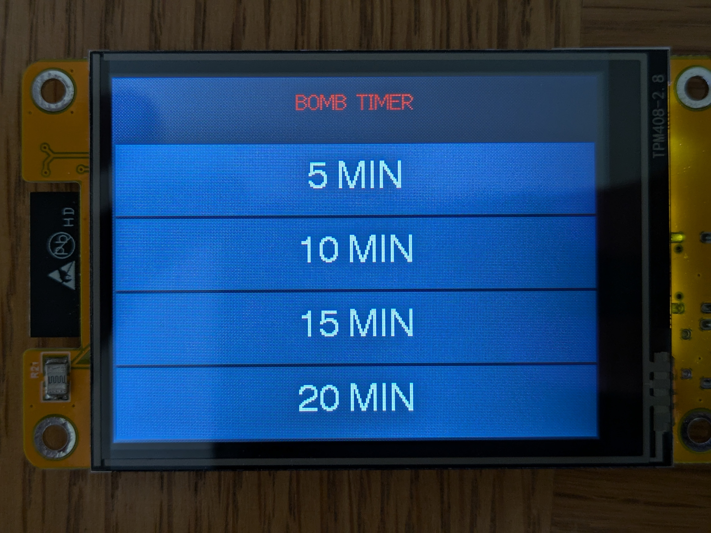
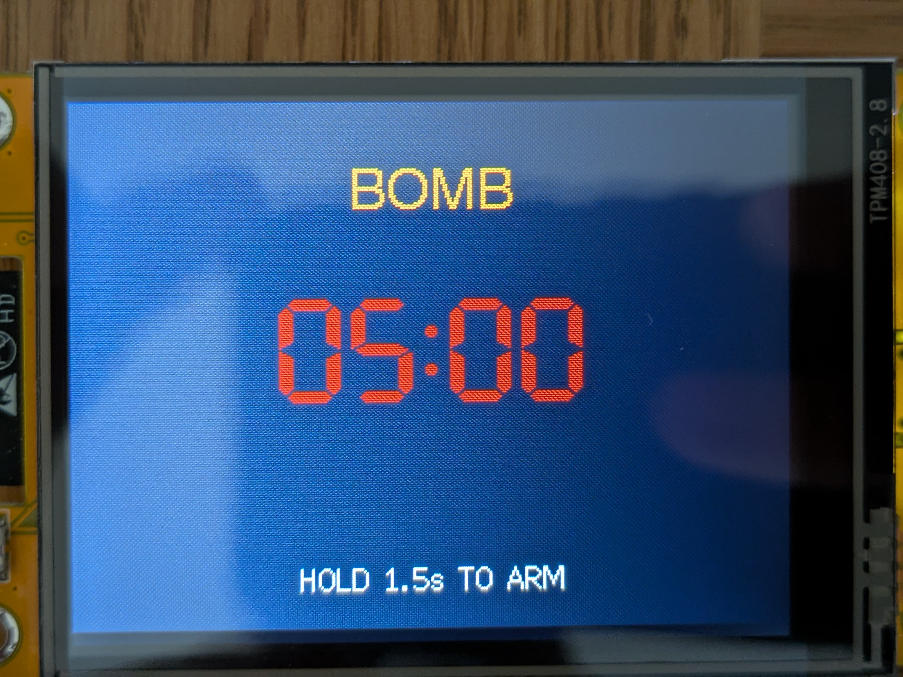
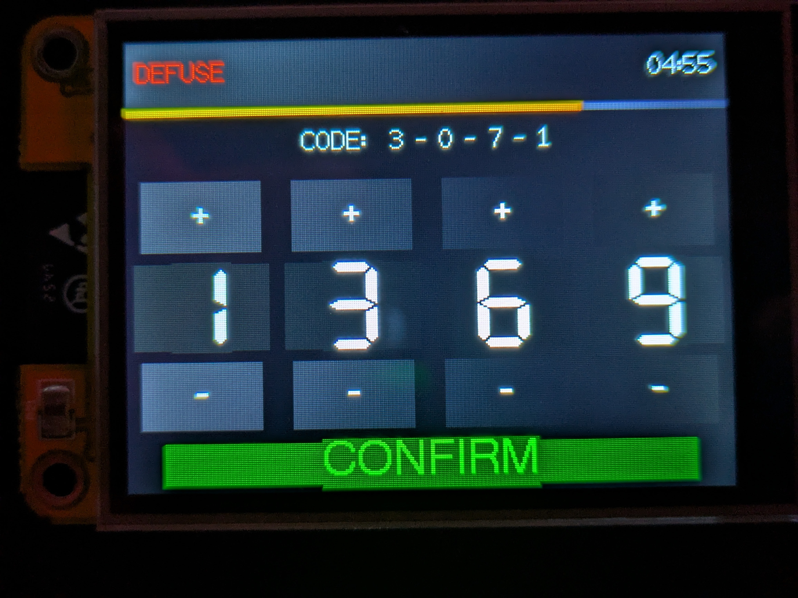

**Controls:**
- Hold 1.5 s on the armed bomb screen → starts the countdown
- Tap screen during countdown → opens defuse puzzle
- Bomb reaches zero → **BOOM**
- Hold top-left corner on the result screen → return to mode select

**Code puzzle:** A 4-dial combination lock. Players must set all four dials to the correct values and tap CONFIRM. Wrong code resets the dials. No attempts are shown to defenders.

**Wire puzzle:** Game master pre-selects the correct wire colour (Red, Blue, Green, or Yellow) in setup. Players tap one wire to cut it — correct wire defuses the bomb, wrong wire triggers immediate detonation.

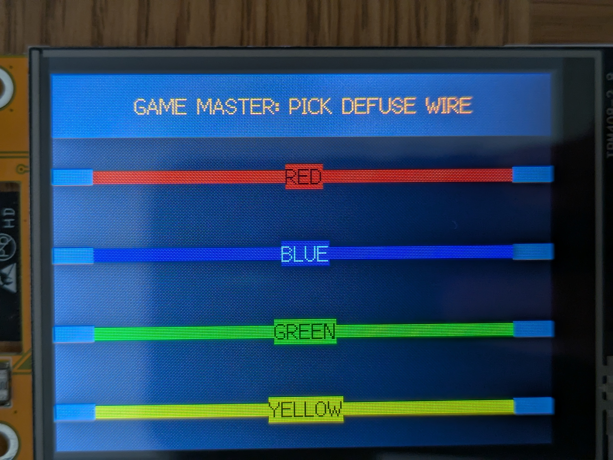
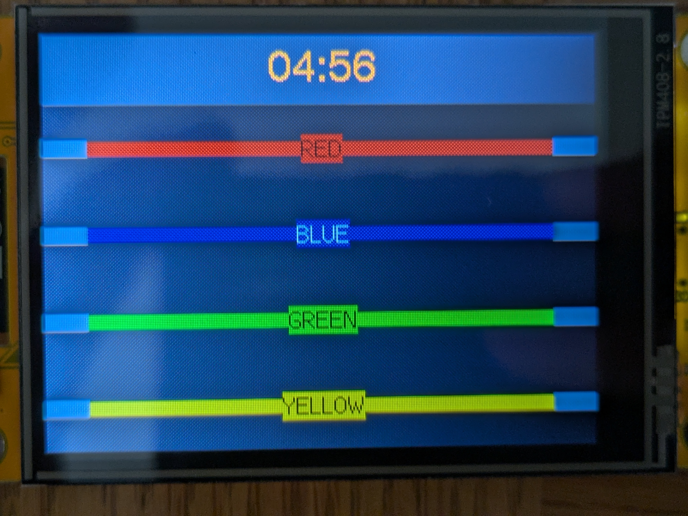

**Setup options:**
- Bomb timer: 5, 10, 15, or 20 minutes
- Defuse mode: Code or Wire

**Bomb location beeps** (via speaker):
- Every 30 s while armed — helps players locate a hidden bomb
- Every 5 s in the last 60 s
- Every 1 s in the last 10 s

---

### Spawn

Tapping **SPAWN** on the main menu opens a sub-menu with three respawn game modes.

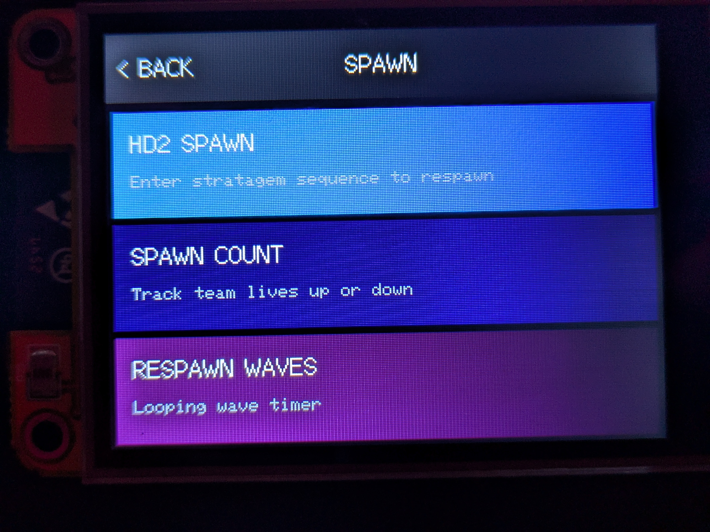

---

### HD2 Spawn — Stratagem Respawn Gate

Inspired by Helldivers 2. Players who are out must enter a random 4-direction arrow sequence correctly to respawn. Gets the dead players doing something rather than just waiting.

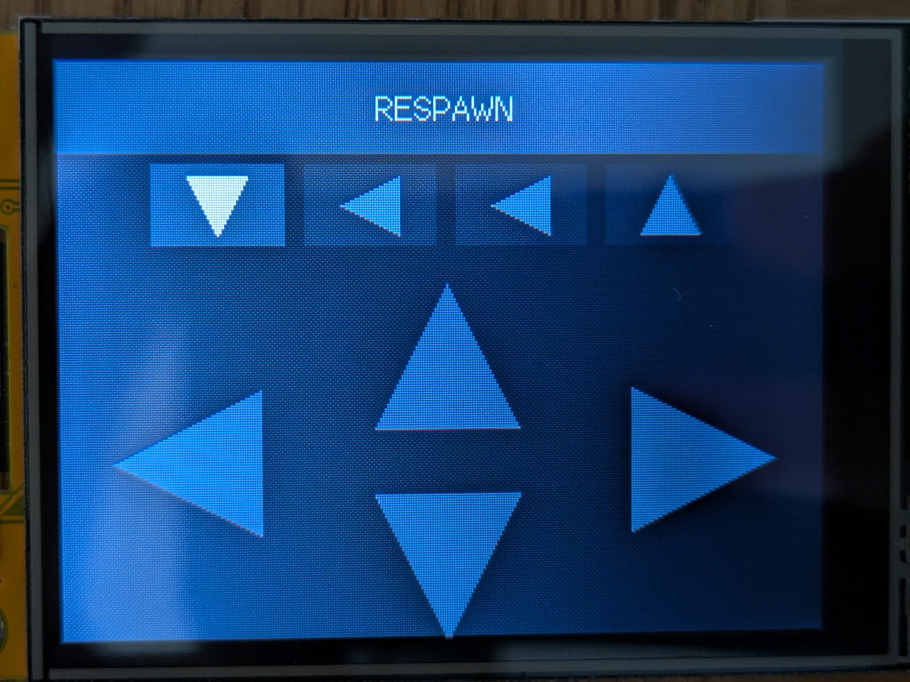

**Controls:**
- Tap the correct arrow direction in sequence (↑ ↓ ← →)
- Wrong input → error flash, sequence resets
- All 4 correct → **RESPAWN** granted

A new random sequence is generated each time.

---

### Spawn Count — Life Tracking

Track remaining lives for a team. Can count up (adding lives) or count down (losing lives). Colour-coded display shows how close to elimination the team is.

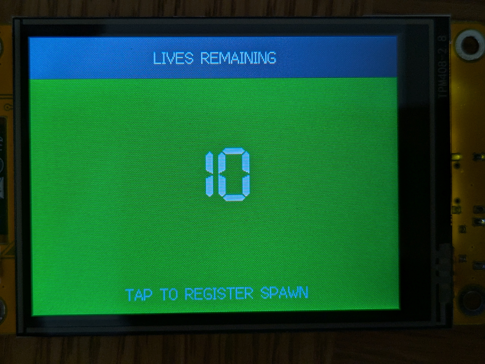

**Countdown colours:**
- Green → above 75% lives remaining
- Yellow → above 50%
- Amber → above 10%
- Red → 10% or fewer lives left

**Controls:**
- Tap **+** / **−** to adjust the count
- Choose count up or count down mode in setup
- Set starting count (5–50 lives)

---

### Respawn Waves — Timed Wave Respawns

A looping countdown timer. When it hits zero, **RESPAWN** flashes on screen and the speaker fires — all dead players respawn simultaneously. Then the timer resets and counts down again.

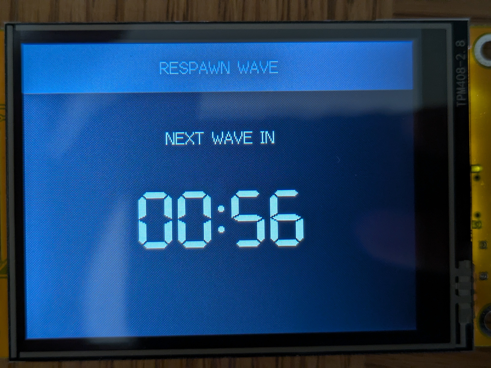

**Controls:**
- Timer runs automatically once started
- Tap screen to reset the current wave early

**Setup options:**
- Wave interval: 30 s, 1, 2, 3, or 5 minutes

---

### Settings

Accessed from the main mode selector.

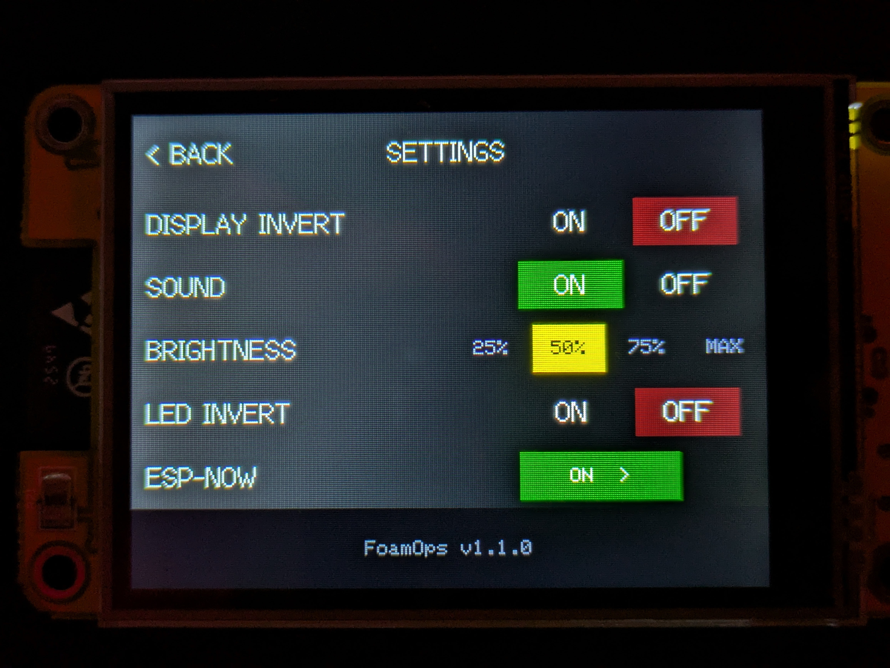

| Setting | Options |
|---|---|
| Display Invert | ON / OFF — corrects colours for some CYD variants |
| Sound | ON / OFF — enables/disables all speaker output |
| Brightness | 25% / 50% / 75% / MAX — PWM backlight control |
| LED Invert | ON / OFF — swaps green/blue LED channels for boards with reversed wiring |
| ESP-NOW | ON / OFF toggle + opens the ESP-NOW settings page (device pairing) |

The firmware version is shown at the bottom of the settings screen. All settings are saved to flash and persist across reboots.

#### ESP-NOW Settings

Tapping the ESP-NOW button opens a dedicated page where you can:
- Toggle ESP-NOW on or off
- View this device's MAC address
- Ping to search for other FoamOps devices in range
- Pair discovered devices
- View already-paired devices and unpair them individually

#### Master Mode

Tapping **MASTER MODE** from the main menu lets you remotely control all paired devices:
- Select the game mode to run across all devices
- Send START / STOP to all paired devices simultaneously
- Push game configuration (colours, time limits) to remotes
- See online/offline status of each paired device

---

## RGB LED

The onboard RGB LED gives a quick visual status visible from a distance:

| State | LED colour |
|---|---|
| Flux — left team running | Left team's colour |
| Flux — right team running | Right team's colour |
| Defuse — armed / ready | Amber |
| Defuse — countdown running | Red |
| Defuse — puzzle open | Orange |
| Defuse — exploded | Red |
| Defuse — defused | Green |
| HD2 Spawn — success | Green |
| Spawn Count — lives remain | Blue |
| Spawn Count — zero lives | Red |
| Respawn Waves — counting | Blue |
| Respawn Waves — RESPAWN! | Green |
